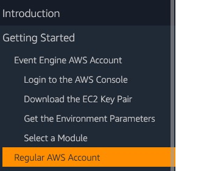
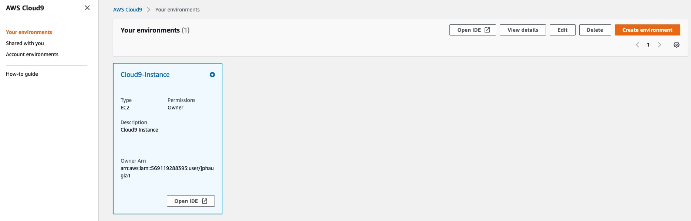
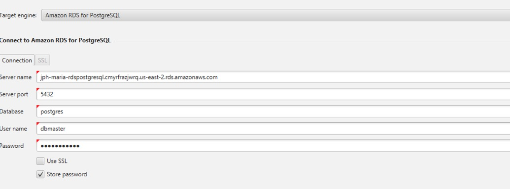

# Convert MariaDB to Aurora Postgres

## Purpose

Demo converting MariaDB database to postgresql using MariaDB and PostgresSQL RDS instances with SCT and DMS.  Additional option to use Kinesis in between DMS and Aurora.


&nbsp;

## Outline

- [Overview](#overview)
- [AWS Services Used](#aws-services-used)
- [Technical Overview](#technical-overview)
- [Instructions](#instructions)
  - [Create Environment](#create-environment)
  - [Edit Security Group Settings](#edit-security-group-settings)
- [MariaDB Setup](#mariadb-setup)
  - [Create Sample Databases](#create-sample-databases)
- [Windows Setup](#windows-setup)
  - [SCT](#sct)
  - [Troubleshooting Windows](#troubleshooting-windows)
- [MariaDB with DMS](#mariadb-with-dms)
  - [MariaDB Replication](#mariadb-replication)
  - [MariaDB Drop Foreign Keys](#mariadb-drop-foreign-keys)
- [Create DMS Resources](#create-dms-resources)
  - [Create DMS Replication Instance](#create-dms-replication-instance)   
  - [Create DMS Endpoints](#create-dms-endpoints)
  - [Create MariaDB to Postgresql Task](#create-mariadb-to-postgresql-task)
  - [Create MariaDB to Kinesis Task](#create-mariadb-to-kinesis-task)
- [Cleaning up](#cleaning-up)


&nbsp;

## Overview

Initially used a CloudFormation template from [Data Migration Immersion Day](https://dms-immersionday.workshop.aws/en).  This template has been modified to include an MariaDB RDS instance with DMS components.   This readme documents using SCT/DMS to convert MariaDB sample databases to RDS PostgeSQL or Aurora PostgreSQL.

## AWS Services Used

* [AWS DMS Database Migration Service](https://aws.amazon.com/dms/)
* [AWS SCT Schema Conversion Tool](https://aws.amazon.com/dms/schema-conversion-tool/)
* [AWS Cloudformation](https://aws.amazon.com/cloudformation/)
* [AWS DMS Workshop](https://dms-immersionday.workshop.aws/en)
* [Amazon Kinesis](https://aws.amazon.com/kinesis)
* [AWS Cloud 9](https://aws.amazon.com/cloud9/)
* [Amazon RDS](https://aws.amazon.com/rds/)

## Technical Overview

* Bring up DMS/SCT environment using modified immersion day template
* Review Security Group Settings
* Create sample MariaDB databases using Cloud9
* Use SCT and DMS to convert sample MariaDB databases to PostgreSQL
* Additional DMS setup to use kinesis 

&nbsp;

---

&nbsp;

## Instructions

***IMPORTANT NOTE**: Creating this demo application in your AWS account will create and consume AWS resources, which **will cost money**.  Costing information is available at [AWS DMS Pricing](https://aws.amazon.com/dms/pricing/)   The template will cost money for the other resources as well.

&nbsp;

### Create Environment

* Some tips on creating an AWS account with [AWS Account instructions](https://dms-immersionday.workshop.aws/en/envconfig/regular.html)
* After reviewing  "Introduction" and "Getting Started", follow the Regular AWS Account instructions. 
* Complete the "Login to the AWS Console" and "Create an EC2 Key Pair" steps
* In the "Configure the Environment" step, use the provided ./templates/maria2PG.yaml [maria2PG yaml](https://github.com/jphaugla/awsMariaDBtoPostgresql/blob/main/templates/maria2PG.yaml).  Choose SQL Server for the source database

### Edit Security Group Settings
* Find the security group.  There are two security group created with the template.  Click on the InstanceSecurityGroup (not the DMSSecurityGroup)
* Tighten security on the RDP rule.  Currently, the windows EC2 instance RCP port it is open to public
    * Click "Edit Inbound Rules"
    * on the RDP inbound rule, remove "0.0.0.0/16" and put in the address obtained in checkip with a /32  e.g.  "1.2.3.4/32"
    * open all internal communication on private.  Easy way is to change the inbound rule with Access Type of Oracle-RDS to All TCP
    * Click "save rules"

## MariaDB Setup
The MariaDB is set up as an RDS instance by the maria2PG cloudformation yaml file.  In the next step, an mysql/mariadb configuarion file will be created to defaul connection to our mysql instance.
Set up the environment to connect to MariaDB using Cloud9

* Open the cloud 9 instance by going to the Cloud 9 Console
* Open the IDE created by the MariaDB cloudformation template by clicking on the "Open IDE" button 
* Create a mysql environment file to easily connect to MariaDB from Cloud9.  The file can not be in the default environment directory of Cloud9.  The file needs to be in your account's home directory.  Do ```cd ..``` to get to home directory.  The file name starts with a period and is named ".my.cnf"
* File example is below.  For the host name, use the target mariaDB source endpoint. This is very wordy [mysql doc link](https://dev.mysql.com/doc/refman/8.0/en/option-files.html)
```bash
[client]
host=your-project-mariadb.cmyrfrazjwrq.your-region.rds.amazonaws.com
user=dbmaster
password=dbmaster123
```
* connect to the mariaDB database using the pre-installed mysql client
```bash
jphaugla1:~/environment $ mysql
Welcome to the MySQL monitor.  Commands end with ; or \g.
Your MySQL connection id is 127
Server version: 5.5.5-10.4.8-MariaDB-log Source distribution

Copyright (c) 2000, 2018, Oracle and/or its affiliates. All rights reserved.

Oracle is a registered trademark of Oracle Corporation and/or its
affiliates. Other names may be trademarks of their respective
owners.

Type 'help;' or '\h' for help. Type '\c' to clear the current input statement.

mysql>
```

### Create sample databases
This is a set of mysql [sample databases](https://dev.mysql.com/doc/index-other.html).  There is a pdf instruction guide for each of these sample databases also.  I will give the quickstart level steps but read these PDFs for more information

* These are the sample databases 
  * Note  a change was made to the parameter group for mariadb to prevent errors on the sakila import
  * need to set log_bin_trust_function_creators =1  
  * This is the error if the parameter is not set
```bash
  ERROR 1419 (HY000) at line 214 in file: './sakila-schema.sql': You do not have the SUPER privilege and binary logging is enabled (you *might* want to use the less safe log_bin_trust_function_creators variable)```
```
* Commands do download all these environments
```bash
wget https://downloads.mysql.com/docs/world.sql.gz
wget https://downloads.mysql.com/docs/world_x-db.tar.gz
wget https://downloads.mysql.com/docs/sakila-db.tar.gz
wget https://downloads.mysql.com/docs/menagerie-db.tar.gz
git clone https://github.com/datacharmer/test_db.git
```
* Uncompress each of the sample databases
```bash
tar -xvzf menagerie-db.tar.gz 
tar -xvzf sakila-db.tar.gz
gunzip world.sql.gz 
tar -xvzf world_x-db.tar.gz
```
* include each of the databases
  * create sakila and both world databases
```bash
mysql
source sakila-db/sakila-schema.sql
source sakila-db/sakila-data.sql
source world_x-db/world_x.sql
source world.sql
exit
```
  * now test_db
```bash
cd test_db
mysql < employees.sql
cd ..
```
  * finally, the menagerie database
```bash
cd menagerie-db
mysql
create database menagerie;
use menagerie;
SOURCE cr_pet_tbl.sql
LOAD DATA LOCAL INFILE 'pet.txt' INTO TABLE pet;
SOURCE ins_puff_rec.sql
SOURCE cr_event_tbl.sql
LOAD DATA LOCAL INFILE 'event.txt' INTO TABLE event;
```

## Windows Setup


### SCT

Return back to the DMS and SCT steps using the SQL Server to Amazon Aurora PostgreSQL

* Start back at this point in the [guide](https://dms-immersionday.workshop.aws/en/sqlserver-aurora-postgres.html)
* Perform the following Part 1 Schema Conversion Steps: "Connect to the EC2 Instance", "Install the AWS Schema Conversion Tool (AWS SCT)"
* Restart the Windows Server (this seems to be important after the SCT install)
* Create a New Project using New Project Wizard 
* Connect to MariaDB 
* Accept the risks
* Click on the each of the databases on the left panel and click "Next" to generate the assessment report
    * I have saved all the assessment reports for these example databases in a [github folder](https://github.com/jphaugla/awsMariaDBtoPostgresql/tree/main/reports)
* Click Next and enter parameters for Aurora PostgreSQL connection 
    * To find the password, look back in the original templates/maria2PG.yaml in the repository home
    * Click "Finish"
* Right click on each schema in the left panel and select Convert Schema to generate the data definition language (DDL) statements for the target database.
* Right click on each schema in the right-hand panel, and click Apply to database. click Yes
* Can see the tables now in the target database.  Use the pgadmin tool to verify the new schema exists but is not populated.
* NOTE:  if using mysql workbench to connect to mariaDB, must be at 10.5 or higher.  At 10.4, mysql workbench can not read the schmema

### Troubleshooting Windows

* if can't connect through ports
    * Disable Windows Defender [Disable Defender](https://support.microsoft.com/en-us/windows/turn-microsoft-defender-firewall-on-or-off-ec0844f7-aebd-0583-67fe-601ecf5d774f)
    * Restart the windows machine (yep, it is not 1995 but restarting a windows machine never hurts!)
 
## MariaDB with DMS

Several links for background on changes needed for MariaDB setup with DMS

* Link for using MariaDB/Mysql as a source for DMS [MariaDB DMS](https://docs.aws.amazon.com/dms/latest/userguide/CHAP_Source.MySQL.html) 
* Turn on replication for RDS MariaDB
  * for reference, these are steps for EC2 MariaDB

### MariaDB Replication

* For documentation, directions for [self-managed MySQL replication](https://docs.aws.amazon.com/dms/latest/userguide/CHAP_Source.MySQL.html#CHAP_Source.MySQL.CustomerManaged)
* [Turn on replication for RDS MariaDB](https://docs.aws.amazon.com/dms/latest/userguide/CHAP_Source.MySQL.html#CHAP_Source.MySQL.AmazonManaged)
  * Automated backups are turned on with the cloudformation script
  * Ensure that the binary logs are available to AWS DMS. Because AWS-managed MySQL-compatible databases purge the binary logs as soon as possible, you should increase the length of time that the logs remain available. For example, to increase log retention to 24 hours, run the following command.
```bash
mysql
call mysql.rds_set_configuration('binlog retention hours', 24);
```
  * These parameters are set in the cloudformation yaml file for the MariaDB parameter group
    * binlog_format: "ROW"
    * binlog_checksum: "NONE"
  
### MariaDB Drop Foreign Keys
These sample databases don't have foreign keys but they would need to be dropped here if any existed

## Create DMS Resources
These resources are automatically created if the flag is set in the script but the task must be started manually

Some choices here.  In addition, can add a separate Migration Task using the same MariaDB source tables but with a target Kinesis endpoint.  In this scenario, there are no mapping rules but a separate Kinesis stream is needed for each table.  The streams are defined in the cloud formation template as well.

### Create DMS Replication Instance 

* Follow steps from [immersion training](https://dms-immersionday.workshop.aws/en/sqlserver-aurora-postgres/data-migration/replication-instance/replication-instance.html)

### Create DMS Endpoints 
If the parameter "CreateDMSComponents" in the initial Cloudformation template was set to true, these components will already be created and need validation.  Test the source MariaDB endpoint.  Verify aurora and kinesis endpoint tests was successful.

* To review, follow these [Steps](https://dms-immersionday.workshop.aws/en/sqlserver-aurora-postgres/data-migration/endpoints/endpoints.html)
* THe specific PostgreSQL endpoints, KinesisEndpoints and TargetKinesis roles are output in the cloudformation

### Create MariaDB to Postgresql Task 
Similar to this create [DMS Migration Task](https://dms-immersionday.workshop.aws/en/sqlserver-aurora-postgres/data-migration/migration-task/migration-task.html)
If the parameter "CreateDMSComponents" in the initial Cloudformation template was set to true, the Task will already be created.  Just start it.

* add a selection rule where schema name is like "%"

* JSON to use directly
```bash
{"rules":[{"rule-type":"transformation","rule-id":"1","rule-name":"1","rule-target":"column","object-locator":{"schema-name":"%","table-name":"%","column-name":"%"},"rule-action":"convert-lowercase","value":null,"old-value":null},{"rule-type":"transformation","rule-id":"2","rule-name":"2","rule-target":"table","object-locator":{"schema-name":"%","table-name":"%"},"rule-action":"convert-lowercase","value":null,"old-value":null},{"rule-type":"transformation","rule-id":"3","rule-name":"3","rule-target":"schema","object-locator":{"schema-name":"%"},"rule-action":"convert-lowercase","value":null,"old-value":null},{"rule-type":"selection","rule-id":"4","rule-name":"4","object-locator":{"schema-name":"MariaDBINST%","table-name":"%"},"rule-action":"include","filters":[]}]}
```

### Create MariaDB to Kinesis Task
This task is created with the script
* Add a kinesis Stream with a shard for each table planning to be moved to kinesis
* Add a kinesis endpoint with these settings:
    * MessageFormat: json
    * ServiceAccessRoleArn "Kinesis Role ARN"  see [this link for role requirements](https://docs.aws.amazon.com/dms/latest/userguide/CHAP_Target.Kinesis.html#CHAP_Target.Kinesis.Prerequisites)
    * StreamArn: use kinesis stream ARN from above
    * Could not get this to work on the cloudformation but add these two parameters
        * IncludePartitionValue: true
        * PartitionIncludeSchemaTable: true
* Create DMS Migration Task
    * SourceEndpoint is DMSMariaDBEndpoint
    * TargetEndpoint is DMSKinesisEndpoint
    * JSON mapping string
```bash
{"rules":[{"rule-type":"selection","rule-id":"1","rule-name":"1","object-locator":{"schema-name":"MariaDBINST%","table-name":"EMPLOYEE"},"rule-action":"include","filters":[]},{"rule-type":"selection","rule-id":"2","rule-action":"include","object-locator":{"schema-name":"MariaDBINST%","table-name":"DEPARTMENT"},"rule-name":"2"}]}
```
    
    
### Cleaning up

Remove all files from S3 to avoid accruing unnecessary charges

&nbsp;

---

&nbsp;
